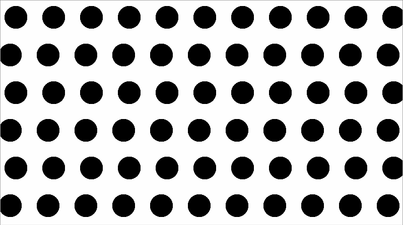
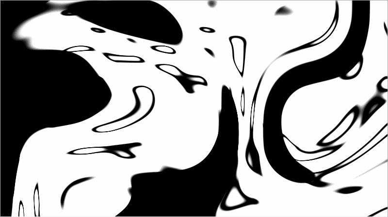

# Gallery

1. [2d noise.frag](./2d noise.frag)

   

2. [brick_tile.frag](./brick_tile.frag)

   

3. [distance.frag](./distance.frag)

   

4. [eye.frag](./eye.frag)

   

5. [fbm 01.frag](./fbm 01.frag)

   

6. [fluid noise.frag](./fluid noise.frag)

   

7. [ikeda.frag](./ikeda.frag)

   

8. [KIFS Fractals.frag](./KIFS Fractals.frag)

   

9. [marching_dots.frag](./marching_dots.frag)

   

10. [mosaic.frag](./mosaic.frag)

    

11. [noise.frag](./noise.frag)

    

12. [polar coordinate.frag](./polar coordinate.frag)

    

13. [rainbow01.frag](./rainbow01.frag)

    

14. [rainbow02.frag](./rainbow02.frag)

    

15. [ray marching 01.frag](./ray marching 01.frag)

    

16. [ray marching 02.frag](./ray marching 02.frag)

    

17. [shape.frag](./shape.frag)

    

18. [simplex grid.frag](./simplex grid.frag)

    

19. [splatter.frag](./splatter.frag)

    

20. [tile.frag](./tile.frag)

    

21. [transform.frag](./transform.frag)

    

22. [truchetPattern.frag](./truchetPattern.frag)

    

23. [voronoi 01.frag](./voronoi 01.frag)

    

24. [voronoi 02.frag](./voronoi 02.frag)

    